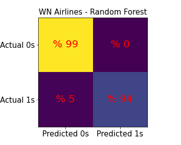

# The turnaround time prediction to schedule flights based on the real flight data of 2015 by using the machine learning technics 
## Table of contents
* [Introduction](#Introduction)
* [Methodology and data](#Methodology-and-data)
* [Results and discussion](#Results-and-discussion)
* [Setup](#setup)

## Introduction
The air transport demand keeps growing, schedules of flights in the global air transport system become more complex. The number of flights has increased since the early 2000s up to 2019 globally. This increase reached from 23.8 million in 2005 to 38.9 million in 2019 while in 2020 with increasing the Coronavirus pandemic,   the number of flight dropped to 16.4 million [“Global air traffic - number of flights 2004-2021”, Published by E. Mazareanu, Dec 2, 2020, https://www.statista.com/statistics/564769/airline-industry-number-of-flights/#statisticContainer]. 
Based on the above data, one of the operational goals of the air transport industry is to optimize the time of Gate‐to‐gate for flights, called Turnaround time (TAT). TAT is one of the most important parts to schedule flights in the airports. TAT is defined as the time required for an aircraft on the ground to be prepared for the departure from its arrival time at the gate.  [M. Abd Allah Makhloof, M. Elsayed Waheed, Usama A. El-Raouf Badawi. (2014) Real-time aircraft turnaround operations manager. Production Planning & Control 25:1, pages 2-25. ]. TAT is generally time consuming and not pleasant for passengers and costly for airlines. Airlines lose money due to inefficiency in plane boarding as they like to have their planes in the air in the minimum possible time. TAT is still a bottleneck in bringing the passengers to their seats and getting the plane to take-off in an efficient time.  
A survey by the U.S. Department of Transportation's Bureau of Transportation Statistics published information of the on-time performance of domestic flights operated by large air carriers. Summary information on the number of on-time, delayed, canceled, and diverted flights is published in the U.S. Department of Transportation's monthly Air Travel Consumer Report and in this dataset of 2015 flight delays and cancellations [https://www.kaggle.com/usdot/flight-delays].
The aim of this work is to predict the scheduling turnaround time of an aircraft in order to decrease conflicts of flights, maximize the passenger conveniences and optimize cost of air carriers. The details of the data are given in next Section with machine learning results and case studies of the proposed aircraft turnaround model.

## Methodology and data
In this work we used the data published by the U.S. Department of Transportation's (DOT) Bureau of Transportation Statistics. They track the on-time performance of domestic flights operated by large air carriers in 2015 in the USA.  [https://www.transtats.bts.gov/OT_Delay/OT_DelayCause1.asp].
The data file has more than 5 milion data and each data is included information of  'year', 'month', 'day', 'day_of_week', 'airline', 'flight_number', 'tail_number', 'origin_airport', 'destination_airport', 'scheduled_departure', 'departure_time', 'departure_delay', 'taxi_out', 'wheels_off', 'scheduled_time', 'elapsed_time', 'air_time', 'distance', 'wheels_on', 'taxi_in', 'scheduled_arrival', 'arrival_time', 'arrival_delay', 'diverted', 'cancelled', 'cancellation_reason', 'air_system_delay', 'security_delay', 'airline_delay',  'late_aircraft_delay', 'weather_delay'. Due to missing information in some records (rows) or modifying some columns, we make a new data frame. Let’s explain about the new table. ‘year’, 'month', 'day', 'day_of_week' columns should be converted to standard date (month/day/year) in pandas library. Then those columns are compressed into one column. ‘airline’ column is including fourteen of the most popular airlines in the USA. Based on the size of the data file is huge, we divided data into fourteen data frames and each new data frame is assigned for one airline. 'Flight_number' is removed because this study is focused on TAT based on airlines and airports. It could be able to track the aircraft travels by 'tail_number', 'origin_airport', and 'destination_airport’ columns. 'Scheduled_departure', 'departure_time', 'scheduled_time', 'air_time', 'scheduled_arrival', 'arrival_time' columns are about time of flights for schedule, departure and arriving. They are used to calculate TAT but in first step we should modified them to the standard time. For example in ‘scheduled_departure' column, it is reported number 1608, this number means the time is 4:08 pm. 
'ARRIVAL_DELAY', 'AIR_SYSTEM_DELAY', 'SECURITY_DELAY', 'AIRLINE_DELAY',  'LATE_AIRCRAFT_DELAY', 'WEATHER_DELAY', 'DEPARTURE_DELAY', 'TAXI_OUT', 'WHEELS_OFF', 'ELAPSED_TIME', 'WHEELS_ON',  and 'TAXI_IN' columns are used to obtain TAT time. This study is not related to divert and cancelation then we remove 'DIVERTED', 'CANCELLED', and 'CANCELLATION_REASON' columns.
Our goal is to predict turnaround time of flights. Then we should add a new column (labeled data) as TAT. By regarding definition of TAT as mentioning above, TAT is the difference of the arrival time to an airport and departure time from that airport as well. This problem would be more interesting if we know which airport (airport A) the aircraft is coming to the mentioned airport (airport B) and which airport (airport C) the aircraft will go. Therefor for this issue, we make a new table based on tracking tail numbers. The new table is included information of the departure time and the arrival time from airport A to airport B and departure time from airport B to airport C.  Therefore the turnaround time at the airport B is difference between the arrival time from airport A to airport B and then the departure time from airport B to airport C. we call this new column ‘turnaround_time_B’ since it is the turnaround time of airport B. 
The new table gives information about  'TAIL_NUMBER', 'AIRLINE', 'airport_A', 'airport_B',       'airport_C', 'turnaround_time_ B', 'SCHEDULED_DEPARTURE_AB',       'DEPARTURE_TIME_AB', 'DEPARTURE_DELAY_AB', 'SCHEDULED_ARRIVAL_AB',       'ARRIVAL_TIME_AB', 'ARRIVAL_DELAY_AB', 'SCHEDULED_DEPARTURE_BC',       'DEPARTURE_TIME_BC', 'DEPARTURE_DELAY_BC', 'ELAPSED_TIME_AB',       'ELAPSED_TIME_BC', 'DISTANCE_AB', 'DISTANCEBC'.
Based on some discussions in the following, we drop columns related to the departure information from airport B to C from above table. First, turnaround time B is directly obtained from difference of arrival time from airport A to B and departure time from airport B to C. If the table has those two columns simultaneously when we apply Machine learning models, the model just will be fit with the arrival and departure time. The other features do not important to the prediction. Second, when the aircraft arrives to airport B, nobody knows how long it takes a time to prepare for departure exactly and how much there is a delay time. We just know schedule departure time from airport B to C.
After calculating turnaround time B, the time columns are divided into hour, day, month, and day of week for more interpretation of features.   
## Results and discussion
In this study, the database including 5 million recorded flights for the fourteen most popular airlines in the USA in 2015, table 1. We focus to analyze data of the airlines with more than 10 percent of total flights. Based on table 1, Airlines WN, AA, and OO with %22, %12, and %10 number flights respectively, they have more stock of flights.
The datafram is divided into 1217135, 673631, and 554286 tables for WN, AA, and OO airlines respectively. Every datafram has 20 columns included 'airport_A', 'airport_B', 'airport_C',    'DEPARTURE_DELAY_AB', 'ARRIVAL_DELAY_AB', 'ELAPSED_TIME_AB', 'DISTANCE_AB', 'DISTANCE_BC', 'DEPARTURE_HOUR_AB', 'DEPARTURE_weekday_AB', 'DEPARTURE_day_AB', 'DEPARTURE_month_AB', 'ARRIVAL_HOUR_AB', 'ARRIVAL_weekday_AB', 'ARRIVAL_day_AB',  'ARRIVAL_month_AB', 'SCHEDULED_DEPARTURE_HOUR_BC', 'SCHEDULED_DEPARTURE_weekday_BC', 'SCHEDULED_DEPARTURE_day_BC', and 'SCHEDULED_DEPARTURE_month_BC' as features and ‘turnaround time_B’ as target.


**Table 1** Total flights were 5483816 which carried out with the fourteen most popular airlines in the USA in 2015. The dataframe includes 20 columns. 

|Name airline                |Number data|Number columns|Percentage number flights|
|----------------------------|-----------|--------------|-------------------------| 
|American Airlines (AA)      |673631     |20            |%12.28		          |
|Alaska Airlines  (AS)	     |168105     |20            |%3.1         		  |
|JetBlue Airlines (B6)	     |252122     |20            |%4.6			  |
|Delta airlines (DL)	     |830012     |20            |%15.1			  |
|Eva Air Airlines (EV)	     |528429     |20  		|%9.6			  |
|Frontier Airlines (f9)	     |87499      |20  		|%1.6			  |
|Hawaiian Airlines (HA)	     |73804      |20  		|%1.3			  |
|American Eagle Airlines (MQ)|265283     |20  		|%4.8			  |
|Spirit Wings Airlines (NK)  |112357     |20  		|%2.1			  |
|SkyWest Airlines (OO)	     |554286     |20  		|%10.1			  |
|United Airlines (UA)	     |471848     |20  		|%8.6			  |
|United States Airlines (US) |189048     |20  		|%3.4			  |
|Virgin America Airlines (VX)|60257      |20  		|%1.1			  |
|Southwest Airlines (WN)     |1217135    |20  		|%22.2			  |		
|Total Airlines in 2015	     |5483816    |20  		|%100			  |

 By using exploratory data analysis (EDA), we can understand much better the data like their histograms. In figure 1, we just show turnaround time B histograms of WN, AA, and OO airlines. For more EDA, you can follow this link: [link of our code]. Regarding figure 1, all three airlines have two distributions for turnaround time B. It means, first we should make a model to predict each data belong which the distributions. Before applying the supervise machine learning on this problem, we keep 10 percent data of each airline as unseen data. After training, modeling and testing the rest of data, we will apply the best model to predict turnaround time of the unseen data. 
 

**Figure 1** Illustrate the TAT histogram of the three most popular airlines in 2015 in the USA.  There are two distributions for each airline. Hence first we confront with a binomial problem to predict the distribution of record data.

For prediction turnaround time, there are two steps. First step is to face with a binomial problem to recognize data is either on the distribution1 (turnaround time less than four hours) or the distribution2 (turnaround time more than four hours). Based on the problem is binomial, we apply Logistic Regression, k-Nearest Neighbors, Random Forest Classifier, and Naive Bayes to build the best model.  In the next section, we’ll show results of matrix confusions to compare those models. 
Second step after categorizing the data based on their TAT are smaller or larger than 4 hours (distributions 1 and 2), we will figure out the best model to predict turnaround time for each distribution. While there is a classification problem in the first step, now we have regression supervised learning. Then we apply the models such as Linear Regression, Gradient Boosting Regressor, and Random Forest Regressor. By calculating the root mean square (RMS) as parameter to realize which model has the best fit for our data.
### Modeling data to predict the category of data distribution 
Since there are two distributions, we apply the binomial models such as Logistic Regression, k-Nearest Neighbors, Random Forest Classifier, and Gaussian Naive Bayes to obtain the best model. We find out the best model based on the diffusion matrixes. From the diffusion matrixes we calculated precision, recall, and f score parameters. Ad they are defined 
Recall = TruePositives / (TruePositives + FalseNegatives) = c11/(c11+c21),
Precision = TruePositives / (TruePositives + FalsePositives) = c11/(c11+c12),
and f score is 
f = 2/(Recall-1 + Precision-1)
where c is the confusion matrix elements.
 Figure 2 shows the diffusion matrixes for OO, AA and WN airlines. In table 2, it is compared precision, recall and f score parameters to determinate the best model. By regarding table 2, the best models are Logistic Regression and Random Forest Classifier for OO and AA airlines respectively. For WN airlines, Logistic Regression, and Random Forest Classifier models give the same recall and precision.

<p float="left">
  
   
</p>

<p float="left">
  
   
</p>
**Figure 2** The diffusion matrix of OO airline (top, left) from Logistic Regression model, AA airline (top, right) from Random Forest Classifier model, WN airline (bottom, left) from Logistic Regression model and WN airline (bottom, right) from Random Forest Classifier model.  0s mentions to distribution 1 and 1s mentions distribution 2.  The yellows, blue areas are percentage of data with the correct predictions in distribution 1 and 2 re percentage of data prediction wrongly  in distribution 1, 2 respectively. 


<table> 
    <caption>**Table 2**  The comparisons between recall and precision parameters for distributions 1 and 2. The best model based on the comparison of f score is the Logistic Regression and Random Forest Classifier for OO and AA airlines respectively. For WN airlines, Logistic Regression, and Random Forest Classifier models give the same recall and precision. </caption> 
    <tr> <th></th><th></th><th></th> <th>Gaussian Naive Bayes</th> <th>k-Nearest Neighbors</th> <th>Logistic Regression</th> <th>Random Forest Classifier</th></tr> 
    <tr> <th rowspan="6">OO Airlines</th> 
  <th rowspan="3">Distribution 1</th>
        <td>Recall</td><td>0.44</td><td>0.99</td><td>0.99</td><td>1.00 </tr> <tr> 
        <td>Precision</td> <td>0.93 </td><td>0.93</td><td>0.96</td><td>0.95</td> </tr> <tr>
        <td>** F % **</td><td>**59.73**</td><td>**95.90**</td><td>**97.48**</td><td>**97.43**</td> </tr> <tr>
     <th rowspan="3">Distribution 2</th>
    <td>Recall</td><td>	0.28</td><td>0.71</td><td>0.85</td><td>0.79</td> </tr> <tr> 
    <td>Precision</td><td>0.86</td><td>0.97</td><td>0.99</td><td>1.00</td> </tr> <tr>
        <td>** F % **</td><td>**42.24**</td><td>**81.98**</td><td>**91.46**</td><td>**88.26**</td> </tr> <tr>
    
  
  <tr> <th rowspan="6">AA Airlines</th> 
    <th rowspan="3">Distribution 1</th>
        <td>Recall</td><td>0.35</td><td>0.97</td><td>0.96</td><td>0.99 </tr> <tr> 
        <td>Precision</td> <td>0.86</td><td>0.90</td><td>0.93</td><td>0.95</td> </tr> <tr>
        <td>** F % **</td><td>**49.75**</td><td>**93.36**</td><td>**94.46**</td><td>**6.96**</td> </tr> <tr>
     <th rowspan="3">Distribution 2</th>
    <td>Recall</td><td>	0.28</td><td>0.71</td><td>0.85</td><td>0.79</td> </tr> <tr> 
    <td>Precision</td><td>0.86</td><td>0.97</td><td>0.99</td><td>1.00</td> </tr> <tr>
        <td>** F % **</td><td>**42.24**</td><td>**81.98**</td><td>**91.46**</td><td>**88.26**</td> </tr> <tr>
    
  <tr> <th rowspan="6">WN Airlines</th> 
    <th rowspan="3">Distribution 1</th>
        <td>Recall</td><td>0.41	0.99</td><td>0.99</td><td>0.99 </tr> <tr> 
        <td>Precision</td> <td>0.93</td><td>0.93</td><td>0.99</td><td>0.99</td> </tr> <tr>
        <td>** F % **</td><td>**56.91**</td><td>**95.90**</td><td>**99.00**</td><td>**99.00**</td> </tr> <tr>
     <th rowspan="3">Distribution 2</th>
    <td>Recall</td><td>	0.85</td><td>0.67</td><td>0.94</td><td>0.94</td> </tr> <tr> 
    <td>Precision</td><td>0.25</td><td>0.97</td><td>0.99</td><td>0.99</td> </tr> <tr>
        <td>** F % **</td><td>**38.63**</td><td>**79.25**</td><td>**96.43**</td><td>**96.43**</td> </tr> <tr>
        
</table>

The best k-Nearest Neighbors model is obtained at the number of neighbors equals 2 between 1 to 100 neighbors for all three airlines.
Figure 3 shows the fifteen most important features to make the best models for AA, OO, and WN Airlines. For OO airline: SCHEDULED_DEPARTURE_month_BC, airport_A_CHO                             ,airport_B_IAH, for AA airline: SCHEDULED_DEPARTURE_HOUR_BC, ARRIVAL_HOUR_AB, DEPARTURE_HOUR_AB, for WN airline (Logistic Regression model): airport_B_BWI, SCHEDULED_DEPARTURE_HOUR_BC, airport_B_LAS, and for WN airline (Random Forest Classifier model): SCHEDULED_DEPARTURE_HOUR_BC, ARRIVAL_HOUR_AB, DEPARTURE_HOUR_AB are the three most important features to predict the distributions. The most important features of AA and WN airlines are like each other.   

<p float="center">


</p>
**Figure 3** The fifteen most important features of OO airline (first figure from top) from Logistic Regression model, AA airline (second figure from top) from Random Forest Classifier model, WN airline (third figure from top) from Logistic Regression model and WN airline (fourth figure from top) from Random Forest Classifier model.  The most important features of AA and WN airlines from Random Forest Classifier model are the same approximately.

### Modeling data to predict turnaround time B based on knowing its distribution
First of all, the seen data is split based on the turnaround time B is less or more than four hours.  There are two distribution categories for the dat. We apply machine learning models such as Linear Regression, Gradient Boosting Regressor, and Random Forest Regressor on each category of data. In the following, we compare ml models together and then we figure out the best ml model for each distribution separately.
 We split data into two part, train and test data. Here we apply Linear Regression, Gradient Boosting Regressor, and Random Forest Regressor on train data to make a model. Then we predict target of test feature, called predicted data. Finally we calculate the root mean square error (RMSE) to find the best model. Table 3 is the conclusion of the results included RMSE_test_predict of test data and predicted data by the models, RMSE_test_mean of test data and its average, average of train, test and predicted data.
For sure that the train and test samples are not very different from each other, we calculate average of them. If their average close together, it can help to have a good training. Then we compare them with average predicted data. As we expect if the model is a good fit, the average of the predict data should be around the average of the test data. In table 3, for example in first row of data of OO airlines, distribution1, the average of the predict data is -31.93 while average of the train and test data are 0.871 and 0.870 respectively.  It means the linear regression model does not work well on this data at all. While next row of the table for OO airline and applying Gradient Boosting Regressor averages of train, test and predicted data are 0.781, 0.780 and 0.871 respectively.
Next note about this table is the compression of RMSE_test_predict and RMSE_test_mean. A model will get a better fit if RMSE_test_predict is less than RMSE_test_mean. Whatever RMSE_test_predict goes to zero, the model is a better fit. For Example for OO airline, RMSE_test_predict is too larger than RMSE_test_mean for Linear regression while the averages of train and test data are the same. It means the test and train data are sampled perfectly and this model is not suitable to fit the data. For this case, RMSE_test_predict of Gradient Boosting Regressor and RMSE_test_predict of Random Forest Regressor are less than RMSE_test_mean and RMSE_test_predict of Gradient Boosting Regressor is the lowest.  It concludes the best model is Gradient Boosting Regressor for this case.
On that note, Gradient Boosting Regressor model is the best model for distribution1 and distribution2 of OO, AA, and WN airlines.  
Fig 4 shows histogram of test and predicted target of OO, AA, and WN airlines. The predicted target comes from Gradient Boosting Regressor model as the best model of data.
We are interested to know what features are more important for fit data with a Gradient Boosting Regressor model. Fig 5 shows the ten most important features of distribution1 and distribution2 for OO, AA, WN airlines. Based on results, ARRIVAL_HOUR_AB, SCHEDULED_DEPARTURE_HOUR_BC, and APPRIVAL_DELAY_AB for distribution1 and SCHEDULED_DEPARTURE_HOUR_BC, APPRIVAL_DELAY_AB, and DEPARTURE_HOUR_AB for distribution2 are the three most important features of OO, AA, and WN airlines.

<table> 
    <caption>**Table 3**  Comparison Linear Regression, Gradient Boosting Regressor, and Random Forest Regressor models to predict the turnaround time B. Gradient Boosting Regressor model is the best model for distribution1 and distribution2 of OO, AA, and WN airlines.  </caption> 
    <tr> <th></th><th></th><th>Model</th> <th>RMS test_predict</th> <th>RMS test_mean</th> <th>Mean train</th> <th>Mean test</th><td>Mean test_predict</td></tr> 
    <tr> <th rowspan="6">OO Airlines</th> 
    <th rowspan="3">Distribution 1</th>
        <td>Linear Regression</td><td>8635.009496</td><td>0.583960</td><td>0.870899</td><td>0.870498</td><td>-31.93344</td> </tr> <tr> 
        <td>Gradient Boosting Regressor</td> <td>0.289393</td><td>0.583960</td><td>0.870899</td><td>0.870498</td><td>0.870577</td> </tr> <tr>
        <td>Random Forest Regressor</td><td>0.422701</td><td>0.583960</td><td>0.870899</td><td>0.870498</td><td>0.868635</td> </tr> <tr>
     <th rowspan="3">Distribution 2</th>
        <td>Linear Regression</td><td>2.244891</td><td>3.444053</td><td>9.724552</td><td>9.702995</td><td>9.707080</td> </tr> <tr> 
        <td>Gradient Boosting Regressor</td> <td>0.973046</td><td>3.459548</td><td>9.721189</td><td>9.716447</td><td>9.720250</td> </tr> <tr>
        <td>Random Forest Regressor</td><td>1.058651</td><td>3.459065</td><td>9.723550</td><td>9.707000</td><td>9.714718</td> </tr> <tr>
    
  <tr> <th rowspan="6">AA Airlines</th> 
    <th rowspan="3">Distribution 1</th>
        <td>Linear Regression</td><td>0.391387</td><td>0.530024</td><td>1.204137</td><td>1.203021</td><td>1.202494</td> </tr> <tr> 
        <td>Gradient Boosting Regressor</td> <td>0.301565</td><td>0.530024</td><td>1.204137</td><td>1.203021</td><td>1.203819</td> </tr> <tr>
        <td>Random Forest Regressor</td><td>0.410178</td><td>0.530024</td><td>1.204137</td><td>1.203021</td><td>1.202731</td> </tr> <tr>
     <th rowspan="3">Distribution 2</th>
        <td>Linear Regression</td><td>587.676068</td><td>3.986316</td><td>10.466827</td><td>10.488394</td><td>6.158463</td> </tr> <tr> 
        <td>Gradient Boosting Regressor</td> <td>0.844714</td><td>3.950069</td><td>10.477505</td><td>10.445680</td><td>10.445323</td> </tr> <tr>
        <td>Random Forest Regressor</td><td>1.016071</td><td>3.961868</td><td>10.471530</td><td>10.469583</td><td>10.470858</td> </tr> <tr>
   
  <tr> <th rowspan="6">WN Airlines</th> 
    <th rowspan="3">Distribution 1</th>
        <td>Linear Regression</td><td>0.296270</td><td>0.370710</td><td>0.838973</td><td>0.840945</td><td>0.839716</td> </tr> <tr> 
        <td>Gradient Boosting Regressor</td> <td>0.237668</td><td>0.370710</td><td>0.838973</td><td>0.840945</td><td>0.840734</td> </tr> <tr>
        <td>Random Forest Regressor</td><td>0.304715</td><td>0.370710</td><td>0.838973</td><td>0.840945</td><td>0.839061</td> </tr> <tr>
     <th rowspan="3">Distribution 2</th>
        <td>Linear Regression</td><td>1.804132</td><td>2.943751</td><td>8.757885</td><td>8.822551</td><td>8.788771</td> </tr> <tr> 
        <td>Gradient Boosting Regressor</td> <td>0.544187</td><td>2.898495</td><td>8.770735</td><td>8.771154</td><td>8.772329</td> </tr> <tr>
        <td>Random Forest Regressor</td><td>0.645750</td><td>2.917877</td><td>8.770400</td><td>8.772492</td><td>8.771918</td> </tr> <tr>
    
</table>
<p float="left">
  
   
</p>
<p float="left">
  
   
</p>
<p float="left">
  
   
</p>
** Figure 4** Left and right sides show histogram of test and predicted target of distribution1 and distribution2 respectively. From top to bottom the histograms are related OO, AA and WN airlines. The predicted target comes from Gradient Boosting Regressor model as the best model that we have.

<p float="left">
  
   
</p>
<p float="left">
  
   
</p>
<p float="left">
  
   
</p>
** Figure 5** The ten most important features of OO, AA, WN airlines. Left and right sides are for distribution1 and distribution2 respectively. From top to bottom we have the most features of OO, AA and WN airlines. These results come from Gradient Boosting Regressor model as the best model that we have.  The three most important features of OO, AA and WN airlines are the same based on their distributions. ARRIVAL_HOUR_AB, SCHEDULED_DEPARTURE_HOUR_BC, and APPRIVAL_DELAY_AB for distribution1 and SCHEDULED_DEPARTURE_HOUR_BC, APPRIVAL_DELAY_AB, and DEPARTURE_HOUR_AB for distribution2 are the three most important features of OO, AA, and WN airlines.
### Apply the best models on the unseen data
The unseen data is mixed of two distributions for turnaround time larger or less than four hours. Then we apply two models on data to predict turnaround time, first model to realize the category of turnaround time and next to predict of turnaround time amount. 
As you can see in table 4.
<table> 
    <caption>**Table 4**  Illustrate results of unseen data prediction based on the best ML models found out in previous sections for OO, AA and WN airlines.  </caption> 
    <tr> <th>Airlines</th><th>Model</th> <th>RMS test_predict</th> <th>RMS real_mean</th> <th>Mean real</th> <th>Mean predict</td></tr> 
        <td>OO</td><td>Logistic + Gradient Boosting Regressor models</td><td>0.002488</td><td>0.016632</td><td>2.644437</td><td>2.637634</td> </tr> <tr> 
        <td>AA</td><td>Random Forest Classifier + Gradient Boosting Regressor models</td><td>0.002910</td><td>0.017936</td><td>3.746930</td><td>3.784084</td> </tr> <tr>
        <td>WN</td><td>Random Forest Classifier + Gradient Boosting Regressor models</td><td>0.000691</td><td>0.0095490</td><td>2.293647</td><td>2.293288</td> </tr> <tr>
    </table>
## Setup
To run this project, install it locally using npm:

```
$ cd ../lorem
$ npm install
$ npm start
```
