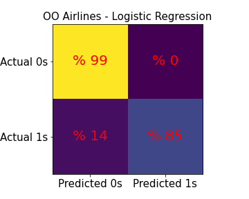

# The turnaround time prediction to schedule flights based on the real flight data of 2015 by using the machine learning technics
## Table of contents
* [1. Introduction](#1-introduction)
* [2. Methodology and data](#2-methodology-and-data)
* [3. Results and discussion](#3-results-and-discussion )
    - [3.1. Predict TAT classes](#31-predict-tat-classes)
    - [3.2. Modeling data to predict turnaround time B based on knowing its distribution](#32-modeling-data-to-predict-turnaround-time-b-based-on-knowing-its-distribution)
    - [3.3. Apply the best models to test data (unseen data)](#33-apply-the-best-models-to-test-data-unseen-data)
* [4. Conclusions](#4-conclusions) 
* [5. Setup](#5-setup)
* [Reference](#reference)

## 1. Introduction
<p style='text-align: justify;'> 
As the air transport demand keeps growing, scheduling of flights in the global air transport systems becomes more and more complex. The number of flights has increased since the early 2000s to 2019 globally. This increase reached from 23.8 million in 2005 to 38.9 million in 2019 while in 2020 the number of flights dropped to 16.4 million because of the Covid-19 pandemic [1].<br />
Based on the above data, one of the operational goals of the air transport industry is to optimize the time of Gate‐to‐gate for flights, called Turnaround time (TAT). TAT is one of the most impactful elements in scheduling flights in the airports. TAT is defined as the time required for an aircraft on the ground to be prepared for the departure from its arrival time at the gate [2].<br />
TAT is generally not pleasant for passengers and costly for airlines. Airlines lose money due to inefficiency in plane boarding as they like to have their planes in the air in the minimum possible time. Therefore predicting the TAT could help airlines and airports to manage their resources more efficiently.<br />
The aim of this work is to predict the scheduling turnaround time of an aircraft in order to decrease conflicts of flights, maximize the passenger conveniences and optimize cost of air carriers. The details of the data, the exploratory data analysis, and the modeling results of TAT is presented in this work.<br />
A survey by the U.S. Department of Transportation's Bureau of Transportation Statistics published information on the on-time performance of domestic flights operated by large air carriers. Summary information on the number of on-time, delayed, canceled, and diverted flights is published in the U.S. Department of Transportation's monthly Air Travel Consumer Report and in this dataset of 2015 flight delays and cancellations [3].<br />

</p>
<p float="left">
  
   
</p>


## 2. Methodology and data
</p>
<p float="right">
  
  
</p>
<p style='text-align: justify;'> 
In this work we used the data published by the U.S. Department of Transportation's (DOT) Bureau of Transportation Statistics. They track the on-time performance of domestic flights operated by large air carriers in the USA.  [4]. <br />
The data file has more than 5 million samples and each sample has information of  'year', 'month', 'day', 'day_of_week', 'airline', 'flight_number', 'tail_number', 'origin_airport', 'destination_airport', 'scheduled_departure', 'departure_time', 'departure_delay', 'taxi_out', 'wheels_off', 'scheduled_time', 'elapsed_time', 'air_time', 'distance', 'wheels_on', 'taxi_in', 'scheduled_arrival', 'arrival_time', 'arrival_delay', 'diverted', 'cancelled', 'cancellation_reason', 'air_system_delay', 'security_delay', 'airline_delay',  'late_aircraft_delay', 'weather_delay'. <br />

The raw data only has the flight information from airport A to B. Hence, we need to create a new table which has the information about TAT (the difference between arrival time to airport B from A and departure from B to C). Also for the first iteration we removed rows with missing data since they are negligible compared to the whole data and converted time columns to standard time as we describe in the following. ‘year’, 'month', 'day', 'day_of_week' columns are converted to standard date (month/day/year). Then those columns are compressed into one column. ‘airline’ column includes fourteen of the most popular airlines in the USA. Since the size of the data file is big and needs a big machine to run the models, for the first iteration we divided the data into fourteen data frames with each new data frame assigned to  one airline. 'Flight_number' is removed because this study is focused on TAT. We track the aircraft travels by 'tail_number', 'origin_airport', and 'destination_airport’ columns. 'Scheduled_departure', 'departure_time', 'scheduled_time', 'air_time', 'scheduled_arrival', 'arrival_time' columns which gives us information about departure and arrival times. They are used to calculate TAT but in the first step we should modify them to the standard time. For example, in ‘scheduled_departure' column, it is reported number 1608, which means the time is 4:08 pm.<br />
 
'ARRIVAL_DELAY', 'AIR_SYSTEM_DELAY', 'SECURITY_DELAY', 'AIRLINE_DELAY',  'LATE_AIRCRAFT_DELAY', 'WEATHER_DELAY', 'DEPARTURE_DELAY', 'TAXI_OUT', 'WHEELS_OFF', 'ELAPSED_TIME', 'WHEELS_ON',  and 'TAXI_IN' columns are used to obtain TAT time. This study is not related to divert and cancelation hence we remove 'DIVERTED', 'CANCELLED', and 'CANCELLATION_REASON' columns.<br />

Our goal is to predict turnaround time of flights. Therefore we should add a new column (labeled data) as TAT by following flights from each aircraft.  Since the tail number is a unique identifier for aircrafts we make a new table based on tracking tail numbers. The new table is included information of the departure time and the arrival time from airport A to airport B and departure time from airport B to airport C.  Therefore the turnaround time at the airport B is difference between the arrival time from airport A to airport B and then the departure time from airport B to airport C. we call this new column ‘turnaround_time_B’ since it is the turnaround time of airport B. <br />

The new table gives information about  'TAIL_NUMBER', 'AIRLINE', 'airport_A', 'airport_B', 'airport_C', 'turnaround_time_ B', 'SCHEDULED_DEPARTURE_AB', 'DEPARTURE_TIME_AB', 'DEPARTURE_DELAY_AB', 'SCHEDULED_ARRIVAL_AB', 'ARRIVAL_TIME_AB', 'ARRIVAL_DELAY_AB', 'SCHEDULED_DEPARTURE_BC', 'DEPARTURE_TIME_BC', 'DEPARTURE_DELAY_BC', 'ELAPSED_TIME_AB', 'ELAPSED_TIME_BC', 'DISTANCE_AB', 'DISTANCEBC'. <br />

To avoid leakage we drop columns related to the departure information from airport B to C from above table. This is because when an aircraft arrives at airport B, there is no information about the departure such as delay time and the only available data is the scheduled departure time from airport B to C. <br />

After calculating turnaround time B, the time columns are divided into hour, day, month, and day of week for EDA. <br />
</p>

## 3. Results and discussion
<p style='text-align: justify;'> 
In this study, the database included 5 million recorded flights for the fourteen most popular airlines in the USA in 2015, table 1. We only focus on analyzing data of the airlines with more than 10 percent of total flights. Based on table 1, Airlines WN, AA, and OO with %22, %12, and %10 number flights, respectively, have the most stock of flights.<br />
The datafram is divided into 1217135, 673631, and 554286 tables for WN, AA, and OO airlines respectively. Every datafram has 20 columns as follow: 'airport_A', 'airport_B', 'airport_C', 'DEPARTURE_DELAY_AB', 'ARRIVAL_DELAY_AB', 'ELAPSED_TIME_AB', 'DISTANCE_AB', 'DISTANCE_BC', 'DEPARTURE_HOUR_AB', 'DEPARTURE_weekday_AB', 'DEPARTURE_day_AB', 'DEPARTURE_month_AB', 'ARRIVAL_HOUR_AB', 'ARRIVAL_weekday_AB', 'ARRIVAL_day_AB',  'ARRIVAL_month_AB', 'SCHEDULED_DEPARTURE_HOUR_BC', 'SCHEDULED_DEPARTURE_weekday_BC', 'SCHEDULED_DEPARTURE_day_BC', and 'SCHEDULED_DEPARTURE_month_BC' as features and ‘turnaround time_B’ as target. <br />
</p>


**Table 1** Total flights were 5483816 which carried out with the fourteen most popular airlines in the USA in 2015. The dataframe includes 20 columns.

|Name airline                |Number data|Number columns|Percentage number flights|
|----------------------------|-----------|--------------|-------------------------| 
|American Airlines (AA)      |673631     |20            |%12.28		          |
|Alaska Airlines  (AS)	     |168105     |20            |%3.1         		  |
|JetBlue Airlines (B6)	     |252122     |20            |%4.6			  |
|Delta airlines (DL)	     |830012     |20            |%15.1			  |
|Eva Air Airlines (EV)	     |528429     |20  		|%9.6			  |
|Frontier Airlines (f9)	     |87499      |20  		|%1.6			  |
|Hawaiian Airlines (HA)	     |73804      |20  		|%1.3			  |
|American Eagle Airlines (MQ)|265283     |20  		|%4.8			  |
|Spirit Wings Airlines (NK)  |112357     |20  		|%2.1			  |
|SkyWest Airlines (OO)	     |554286     |20  		|%10.1			  |
|United Airlines (UA)	     |471848     |20  		|%8.6			  |
|United States Airlines (US) |189048     |20  		|%3.4			  |
|Virgin America Airlines (VX)|60257      |20  		|%1.1			  |
|Southwest Airlines (WN)     |1217135    |20  		|%22.2			  |		
|Total Airlines in 2015	     |5483816    |20  		|%100			  |

<p style='text-align: justify;'> 
 To get some insight about the data we perform exploratory data analysis (EDA). In figure 1, we show the histograms of turnaround time for WN, AA, and OO airlines. For more EDA, you can follow this link: [link of our code]. Carefully investigating figure 1, we observe that the TAT for all three airlines is made of two distributions. This gives us hints to make a classification model first to classify the data in two groups for TAT and then develop regression models for predicting TAT for each group. Before we apply our supervised machine learning technique to this problem, we divide the data to train, cross validation and test and for the test data we keep 10 percent of data from each airline which helps us to measure the performance for unseen data. We train our model with  the training and cross validation data and then use test data to predict turnaround time for unseen data. 
 </p>

**Figure 1** Illustrate the TAT histogram of the three most popular airlines in 2015 in the USA.  There are two distributions for each airline. Hence first we confront with a binomial problem to predict the distribution of record data.

<p style='text-align: justify;'>
s explained we follow two steps to predict the turnaround time. First step is to build a binary classification model to find if a flight belongs to distribution1 (turnaround time less than four hours) or the distribution2 (turnaround time more than four hours). We apply Logistic Regression, k-Nearest Neighbors and, Random Forest Classifier to this problem. In the next section, we’ll show precision, recall and confusion matrix  to compare the models' results. <br />
For the Second step, after clustering the data, we have a regression problem and we apply machine learning techniques Linear Regression, Gradient Boosting Regressor, and Random Forest Regressor to make a prediction for turnaround time. We use root mean square (RMS) as the parameter of performance of the models and finding the best model. 
</p>

## 3.1. Predict TAT classes 
<p style='text-align: justify;'> 
Since there are two distributions, we apply classification methods Logistic Regression, k-Nearest Neighbors and Random Forest Classifier to obtain the best model. We find out the best model based on precision and recall. <br />
In figure 2 we show diffusion matrices for OO, AA and WN airlines. In table 2, we compared precision, recall and f score to determinate the best model. Interestingly one machine learning method is not always the winner. Based on our results (table 2), the best model is Logistic Regression and Random Forest Classifier for OO and AA airlines respectively. For WN airlines, Logistic Regression, and Random Forest Classifier gives the same recall and precision. <br />
</p>

<p float="left">
  
   
</p>

<p float="left">
  
   
</p>
**Figure 2** The diffusion matrix of OO airline (top, left) from Logistic Regression model, AA airline (top, right) from Random Forest Classifier model, WN airline (bottom, left) from Logistic Regression model and WN airline (bottom, right) from Random Forest Classifier model.  0s mentions to distribution 1 and 1s mentions distribution 2.  The yellows, blue areas are percentage of data with the correct predictions in distribution 1 and 2 re percentage of data prediction wrongly  in distribution 1, 2 respectively


<table> 
    <caption>**Table 2**  The comparisons between recall and precision parameters for distributions 1 and 2. The best model based on the comparison of f score is the Logistic Regression and Random Forest Classifier for OO and AA airlines respectively. For WN airlines, Logistic Regression, and Random Forest Classifier models give the same recall and precision. </caption> 
    <tr> <th></th><th></th><th></th> <th>Gaussian Naive Bayes</th> <th>k-Nearest Neighbors</th> <th>Logistic Regression</th> <th>Random Forest Classifier</th></tr> 
    <tr> <th rowspan="6">OO Airlines</th> 
  <th rowspan="3">Distribution 1</th>
        <td>Recall</td><td>0.44</td><td>0.99</td><td>0.99</td><td>1.00 </tr> <tr> 
        <td>Precision</td> <td>0.93 </td><td>0.93</td><td>0.96</td><td>0.95</td> </tr> <tr>
        <td>** F % **</td><td>**59.73**</td><td>**95.90**</td><td>**97.48**</td><td>**97.43**</td> </tr> <tr>
     <th rowspan="3">Distribution 2</th>
    <td>Recall</td><td>	0.28</td><td>0.71</td><td>0.85</td><td>0.79</td> </tr> <tr> 
    <td>Precision</td><td>0.86</td><td>0.97</td><td>0.99</td><td>1.00</td> </tr> <tr>
        <td>** F % **</td><td>**42.24**</td><td>**81.98**</td><td>**91.46**</td><td>**88.26**</td> </tr> <tr>
    
  
  <tr> <th rowspan="6">AA Airlines</th> 
    <th rowspan="3">Distribution 1</th>
        <td>Recall</td><td>0.35</td><td>0.97</td><td>0.96</td><td>0.99 </tr> <tr> 
        <td>Precision</td> <td>0.86</td><td>0.90</td><td>0.93</td><td>0.95</td> </tr> <tr>
        <td>** F % **</td><td>**49.75**</td><td>**93.36**</td><td>**94.46**</td><td>**6.96**</td> </tr> <tr>
     <th rowspan="3">Distribution 2</th>
    <td>Recall</td><td>	0.28</td><td>0.71</td><td>0.85</td><td>0.79</td> </tr> <tr> 
    <td>Precision</td><td>0.86</td><td>0.97</td><td>0.99</td><td>1.00</td> </tr> <tr>
        <td>** F % **</td><td>**42.24**</td><td>**81.98**</td><td>**91.46**</td><td>**88.26**</td> </tr> <tr>
    
  <tr> <th rowspan="6">WN Airlines</th> 
    <th rowspan="3">Distribution 1</th>
        <td>Recall</td><td>0.41	0.99</td><td>0.99</td><td>0.99 </tr> <tr> 
        <td>Precision</td> <td>0.93</td><td>0.93</td><td>0.99</td><td>0.99</td> </tr> <tr>
        <td>** F % **</td><td>**56.91**</td><td>**95.90**</td><td>**99.00**</td><td>**99.00**</td> </tr> <tr>
     <th rowspan="3">Distribution 2</th>
    <td>Recall</td><td>	0.85</td><td>0.67</td><td>0.94</td><td>0.94</td> </tr> <tr> 
    <td>Precision</td><td>0.25</td><td>0.97</td><td>0.99</td><td>0.99</td> </tr> <tr>
        <td>** F % **</td><td>**38.63**</td><td>**79.25**</td><td>**96.43**</td><td>**96.43**</td> </tr> <tr>
        
</table>

<p style='text-align: justify;'> 
For the k-Nearest Neighbors we try between 1 to 100 neighbors for all three airlines and the best model is obtained with 2 nearest neighbors. <br />
Figure 3 shows the feature importance from Random Forest for AA, OO, and WN airlines. For these airlines the most important features are scheduled departure month from airport B to C, airports A, arrival time to airport B, scheduled departure from airport B. The most important features of AA and WN airlines are like each other. <br />    
</p>

<p float="center">


</p>
**Figure 3** The feature importance from Random Forest for airlines OO, AA and WN.  We should note that we use Logistic Regression, Random Forest classifier and, Logistic Regression to find the classes for OO, AA and WN airlines respectively. The features importance for AA and WN airlines are mostly the same.

### 3.2. Modeling data to predict turnaround time B based on knowing its distribution
<p style='text-align: justify;'> 
For the next step we apply Linear Regression, Gradient Boosting Regressor, and Random Forest Regressor to each class. We apply each of these techniques to the training data and then apply the trained model to the cross validation data to find the best model. To evaluate the models we use the root mean square error (RMSE). In Table 3 we show the RMSE results for cross validation and base model. We use the mean as the base model. Also in the table we show the mean of cross validation data and mean of predicted cross validation data.  This results show that Linear Regression is not a good model for OO airline since the predicted RMSE is much bigger than the baseline. However, Gradient Boosting Regressor gives much better results with predicted RMSE almost half the baseline RMSE. <br /> 
Fig 4 shows histogram of cross validation data and predicted for OO, AA, and WN airlines. The predicted target comes from the Gradient Boosting Regressor model as the best model.
For the next step we find the feature importance from the Gradient Boosting Regressor model. Fig 5 shows the first ten feature importance of distribution1 and distribution2 for OO, AA, WN airlines. Based on this plots, arrival hour from airport A to B, scheduled departure hour from A to B and arrival delay from A to B are the most important features for distribution1. Scheduled departure hour, delay in arrival from A to B and departure hour from A to B are the most important features for distribution2. <br />
</p>
<table> 
    <caption>**Table 3**  Comparison Linear Regression, Gradient Boosting Regressor, and Random Forest Regressor models to predict the turnaround time B. Gradient Boosting Regressor model is the best model for distribution1 and distribution2 of OO, AA, and WN airlines.  </caption> 
    <tr> <th></th><th></th><th>Model</th> <th>RMS test_predict</th> <th>RMS test_mean</th> <th>Mean train</th> <th>Mean test</th><td>Mean test_predict</td></tr> 
    <tr> <th rowspan="6">OO Airlines</th> 
    <th rowspan="3">Distribution 1</th>
        <td>Linear Regression</td><td>8635.009496</td><td>0.583960</td><td>0.870899</td><td>0.870498</td><td>-31.93344</td> </tr> <tr> 
        <td>Gradient Boosting Regressor</td> <td>0.289393</td><td>0.583960</td><td>0.870899</td><td>0.870498</td><td>0.870577</td> </tr> <tr>
        <td>Random Forest Regressor</td><td>0.422701</td><td>0.583960</td><td>0.870899</td><td>0.870498</td><td>0.868635</td> </tr> <tr>
     <th rowspan="3">Distribution 2</th>
        <td>Linear Regression</td><td>2.244891</td><td>3.444053</td><td>9.724552</td><td>9.702995</td><td>9.707080</td> </tr> <tr> 
        <td>Gradient Boosting Regressor</td> <td>0.973046</td><td>3.459548</td><td>9.721189</td><td>9.716447</td><td>9.720250</td> </tr> <tr>
        <td>Random Forest Regressor</td><td>1.058651</td><td>3.459065</td><td>9.723550</td><td>9.707000</td><td>9.714718</td> </tr> <tr>
    
  <tr> <th rowspan="6">AA Airlines</th> 
    <th rowspan="3">Distribution 1</th>
        <td>Linear Regression</td><td>0.391387</td><td>0.530024</td><td>1.204137</td><td>1.203021</td><td>1.202494</td> </tr> <tr> 
        <td>Gradient Boosting Regressor</td> <td>0.301565</td><td>0.530024</td><td>1.204137</td><td>1.203021</td><td>1.203819</td> </tr> <tr>
        <td>Random Forest Regressor</td><td>0.410178</td><td>0.530024</td><td>1.204137</td><td>1.203021</td><td>1.202731</td> </tr> <tr>
     <th rowspan="3">Distribution 2</th>
        <td>Linear Regression</td><td>587.676068</td><td>3.986316</td><td>10.466827</td><td>10.488394</td><td>6.158463</td> </tr> <tr> 
        <td>Gradient Boosting Regressor</td> <td>0.844714</td><td>3.950069</td><td>10.477505</td><td>10.445680</td><td>10.445323</td> </tr> <tr>
        <td>Random Forest Regressor</td><td>1.016071</td><td>3.961868</td><td>10.471530</td><td>10.469583</td><td>10.470858</td> </tr> <tr>
   
  <tr> <th rowspan="6">WN Airlines</th> 
    <th rowspan="3">Distribution 1</th>
        <td>Linear Regression</td><td>0.296270</td><td>0.370710</td><td>0.838973</td><td>0.840945</td><td>0.839716</td> </tr> <tr> 
        <td>Gradient Boosting Regressor</td> <td>0.237668</td><td>0.370710</td><td>0.838973</td><td>0.840945</td><td>0.840734</td> </tr> <tr>
        <td>Random Forest Regressor</td><td>0.304715</td><td>0.370710</td><td>0.838973</td><td>0.840945</td><td>0.839061</td> </tr> <tr>
     <th rowspan="3">Distribution 2</th>
        <td>Linear Regression</td><td>1.804132</td><td>2.943751</td><td>8.757885</td><td>8.822551</td><td>8.788771</td> </tr> <tr> 
        <td>Gradient Boosting Regressor</td> <td>0.544187</td><td>2.898495</td><td>8.770735</td><td>8.771154</td><td>8.772329</td> </tr> <tr>
        <td>Random Forest Regressor</td><td>0.645750</td><td>2.917877</td><td>8.770400</td><td>8.772492</td><td>8.771918</td> </tr> <tr>
    
</table>

<p float="left">
  
   
</p>
<p float="left">
  
   
</p>
<p float="left">
  
   
</p>
** Figure 4** Left and right sides show the histogram of the test and predicted target of distribution1 and distribution2 respectively. From top to bottom the histograms are related OO, AA and WN airlines. The predicted target comes from the Gradient Boosting Regressor model as the best model that we have.

<p float="left">
  
   
</p>
<p float="left">
  
   
</p>
<p float="left">
  
   
</p>
** Figure 5** The ten most important features of OO, AA, WN airlines. Left and right sides are for distribution1 and distribution2 respectively. From top to bottom we have the most features of OO, AA and WN airlines. These results come from the Gradient Boosting Regressor model as the best model that we have.  The three most important features of OO, AA and WN airlines are the same based on their distributions. ARRIVAL_HOUR_AB, SCHEDULED_DEPARTURE_HOUR_BC, and APPRIVAL_DELAY_AB for distribution1 and SCHEDULED_DEPARTURE_HOUR_BC, APPRIVAL_DELAY_AB, and DEPARTURE_HOUR_AB for distribution2 are the three most important features of OO, AA, and WN airlines.

### 3.3. Apply the best models to test data (unseen data)
<p style='text-align: justify;'> 
To measure the performance of our models with unseen data we apply the best model from classification to find the class of each test data and then apply the best regression model to predict the TAT. In Table 4 we summarize our results for OO, AA and WN airlines. Our modeling results clearly outperforms the baseline with much smaller RMSE. 
</p>
<table> 
    <caption>**Table 4**  Illustrate results of unseen data prediction based on the best ML models found out in previous sections for OO, AA and WN airlines.  </caption> 
    <tr> <th>Airlines</th><th>Model</th> <th>RMS test_predict</th> <th>RMS real_mean</th> <th>Mean real</th> <th>Mean predict</td></tr> 
        <td>OO</td><td>Logistic + Gradient Boosting Regressor models</td><td>0.002488</td><td>0.016632</td><td>2.644437</td><td>2.637634</td> </tr> <tr> 
        <td>AA</td><td>Random Forest Classifier + Gradient Boosting Regressor models</td><td>0.002910</td><td>0.017936</td><td>3.746930</td><td>3.784084</td> </tr> <tr>
        <td>WN</td><td>Random Forest Classifier + Gradient Boosting Regressor models</td><td>0.000691</td><td>0.0095490</td><td>2.293647</td><td>2.293288</td> </tr> <tr>
    </table>

## 4. Conclusions

this is [1] says.
## 5. Setup
To run this project, install it locally using npm:

```
$ cd ../lorem
$ npm install
$ npm start
```
## Reference
[1]“Global air traffic - number of flights 2004-2021”, Published by E. Mazareanu, Dec 2, 2020, https://www.statista.com/statistics/564769/airline-industry-number-of-flights/#statisticContainer.
[2]M. Abd Allah Makhloof, M. Elsayed Waheed, Usama A. El-Raouf Badawi. (2014) Real-time aircraft turnaround operations manager. Production Planning & Control 25:1, pages 2-25.
[3]https://www.kaggle.com/usdot/flight-delays
[4]https://www.transtats.bts.gov/OT_Delay/OT_DelayCause1.asp
