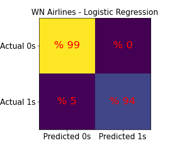

# Flights Turnaround Time Prediction 
## Table of contents
* [1. Introduction](#1-introduction)
* [2. Methodology and data](#2-methodology-and-data)
* [3. Exploratory data analysis (EDA)](#3-exploratory-data-analysis-EDA)
* [4. Modeling and results](#4-modeling-and-results)
    - [4.1. Predict turnaround time classes](#41-predict-turnaround-time-classes)
    - [4.2. Modeling data to predict turnaround time based on knowing its class](#42-modeling-data-to-predict-turnaround-time-based-on-knowing-its-class)
    - [4.3. Apply the best models to test data (unseen data)](#43-apply-the-best-models-to-test-data-unseen-data)
* [5. Conclusions](#4-conclusions) 
* [6. Setup](#5-setup)
* [Reference](#reference)

## 1. Introduction

 
As the air transport demand is growing, scheduling of flights in the global air transport systems becomes more and more complex. The number of flights has increased since the early 2000s to 2019 globally. This increase reached 38.9 million in 2019 from 23.8 million in 2005 while in 2020 the number of flights dropped to 16.4 million because of the Covid-19 pandemic [1]. The number of flights is expected to come back to pre-Covid-19 as countries vaccinate their populations.  
One of the operational goals of the air transport industry is to optimize the time of gate‐to‐gate Turnaround Time (TAT). TAT is defined as the time required for an aircraft on the ground to be prepared for the departure from its arrival time at the gate, figure 1, [2]. 
TAT is one of the most impactful elements in scheduling flights in the airports.  
TAT is generally not pleasant for passengers and costly for airlines. Airlines lose money due to inefficiency in plane boarding as they like to have their planes in the air in the minimum possible time. Therefore predicting the TAT could help airlines and airports to manage their resources more efficiently. 
The aim of this work is to predict TAT in order to decrease conflicts of flights, maximize the passenger conveniences and optimize the cost of air carriers. The detailed description of the data, the exploratory data analysis, and the modeling results of TAT is presented in this work. 

   
 <caption> <b>Figure 1. </b> A schematic of Turnaround time (TAT) based on arrival and departure time.
    

## 2. Methodology and data

   
<caption> <b>Figure 2. </b>  [3]</caption>

 
In this work we used the data published by the U.S. Department of Transportation's (DOT) Bureau of Transportation Statistics [4]. They track the on-time performance of domestic flights operated by large air carriers in the USA [5]. 
The data file has more than 5 million samples and each sample has information of 'year', 'month', 'day', 'day of week', 'airline', 'flight number', 'tail number', 'origin airport', 'destination airport', 'scheduled departure', 'departure time', 'departure delay', 'taxi out', 'wheels off', 'scheduled time', 'elapsed time', 'air time', 'distance', 'wheels on', 'taxi in', 'scheduled arrival', 'arrival time', 'arrival delay', 'diverted', 'cancelled', 'cancellation reason', 'air system delay', 'security delay', 'airline delay', 'late aircraft delay', 'weather delay'.  

 
The raw data only has the flight information from airport A to B. Hence, we need to create a new table which has the information of TAT (the difference between arrival time to airport B from A and departure time from B to C). Also for the first iteration we remove rows with missing data since they are negligible as compared to the whole data. We also converted time columns to standard time as we describe in the following. ‘year’, 'month', 'day', 'day_of_week' columns are converted to standard dates (month/day/year). Then those columns are compressed into one column. ‘airline’ column includes fourteen most popular airlines in the USA. Since the size of the data file is big and needs a big machine to run the models, for the first iteration we divide the data into fourteen data frames with each new data frame assigned to one airline. 'Flight_number' is removed because this study is focused on TAT. We track the aircraft travels by 'tail_number', 'origin_airport', and 'destination_airport’ columns. 'Scheduled_departure', 'departure_time', 'scheduled_time', 'air_time', 'scheduled_arrival', 'arrival_time' columns gives us information about departure and arrival times. They are used to calculate TAT after modifying the times to the standard time.  

 
'ARRIVAL_DELAY', 'AIR_SYSTEM_DELAY', 'SECURITY_DELAY', 'AIRLINE_DELAY', 'LATE_AIRCRAFT_DELAY', 'WEATHER_DELAY', 'DEPARTURE_DELAY', 'TAXI_OUT', 'WHEELS_OFF', 'ELAPSED_TIME', 'WHEELS_ON', and 'TAXI_IN' columns are used to obtain TAT time. This study is not related to divert and cancelation hence we remove 'DIVERTED', 'CANCELLED', and 'CANCELLATION_REASON' columns. 

 
Our goal is to predict the TAT of flights. Therefore we should add a new column (labeled data) as TAT by following flights from each aircraft. Since the tail number is a unique identifier for aircrafts we make a new table based on tracking tail numbers. The new table includes the departure time and the arrival time from airport A to airport B and departure time from airport B to airport C. The TAT at the airport B is calculated by finding the difference between the arrival time from airport A to airport B and the departure time from airport B to airport C. we call this new column ‘turnaround_time_B’ since it is the TAT related to airport B.  

 
The new table has information about 'TAIL_NUMBER', 'AIRLINE', 'airport_A', 'airport_B', 'airport_C', 'turnaround_time_ B', 'SCHEDULED_DEPARTURE_AB', 'DEPARTURE_TIME_AB', 'DEPARTURE_DELAY_AB', 'SCHEDULED_ARRIVAL_AB', 'ARRIVAL_TIME_AB', 'ARRIVAL_DELAY_AB', 'SCHEDULED_DEPARTURE_BC', 'DEPARTURE_TIME_BC', 'DEPARTURE_DELAY_BC', 'ELAPSED_TIME_AB', 'ELAPSED_TIME_BC', 'DISTANCE_AB', 'DISTANCEBC'.  
The database included 5 million recorded flights for the fourteen most popular airlines in the USA in 2015, table 1. We only focus on analyzing data of the airlines with more than 10 percent of total flights. Based on table 1, Airlines WN, DL, AA, and OO with %22, %15, %12, and %10 number flights, respectively, have the most stock of flights. 
The datafram is divided into 1217135, 830012, 673631, and 554286 tables for WN, DL, AA, and OO airlines respectively. Every datafram has 20 columns as we described above. 

 
To avoid leakage we drop columns related to the departure information from airport B to C from the above table. This is because when an aircraft arrives at airport B, there is no information about the departure such as delay time and the only available data is the scheduled departure time from airport B to C.  

<table> 
    <caption><b>Table 1.</b>  The percentage number of flights for different airlines. Airlines WN, Dl, AA and OO with %22, %12, %15 and %10 number flights, respectively, have the most stock of flights. Total flights were 5483816 which carried out with the fourteen most popular airlines in the USA in 2015. The dataframe includes 20 columns.
  </caption> 
    <tr align="center"> <th>Airlines</th><th>Number Data</th> <th>Percentage number flights</td></tr> 
    <td align="center">American Airlines (AA)</td><td align="center">673631 </td><td align="center">%12.28</td></tr>
    <td align="center">Alaska Airlines  (AS)</td><td align="center">168105      </td><td align="center">%3.1</td></tr>
    <td align="center">JetBlue Airlines (B6)</td><td align="center">252122      </td><td align="center">%4.6</td></tr>
    <td align="center">Delta airlines (DL)  </td><td align="center">830012      </td><td align="center" >%15.1</td></tr>
    <td align="center">Eva Air Airlines (EV)</td><td align="center">528429      </td><td align="center">%9.6	</td></tr>
    <td align="center">Frontier Airlines (f9) </td><td align="center">87499       </td><td align="center">%1.6</td></tr>
    <td align="center">Hawaiian Airlines (HA) </td><td align="center">73804       </td><td align="center">%1.3	</td></tr>
    <td align="center">American Eagle Airlines (MQ) </td><td align="center">265283  </td><td align="center">%4.8	</td></tr>
    <td align="center">Spirit Wings Airlines (NK) </td><td align="center">112357    </td><td align="center">%2.1	</td></tr>
    <td align="center">SkyWest Airlines (OO) </td><td align="center">554286   </td><td align="center">%10.1	</td></tr>
    <td align="center">United Airlines (UA) </td><td align="center">471848     </td><td align="center">%8.6	</td></tr>
    <td align="center">United States Airlines (US) </td><td align="center">189048  </td><td align="center">%3.4	</td></tr>
    <td align="center">Virgin America Airlines (VX) </td><td align="center">60257   </td><td align="center">%1.1	</td></tr>
    <td align="center">Southwest Airlines (WN) </td><td align="center">1217135  </td><td align="center">%22.2	</td></tr>
    <td align="center">Total Airlines in 2015	 </td><td align="center">5483816   </td><td align="center">%100	</td></tr>   
</table>

## 3. Exploratory data analysis (EDA)

 
 In this section we perform some EDA to gain some insights about the data. In figure 3, we show the histograms of TAT for OO, AA, DL and WN airlines. Figures 4, 5, 6 and 7 show the difference between max and min of TAT (we call it maxmin time interval), average of TAT and number of arrival flights from airport A to B, departure flights from airport A to B and scheduled departure flights from airport B to C as a function of hours in a day and arrival delay time from airport A to B as a function of interval time via hour for OO, AA, DL and WN airlines respectively. 
We can observe that (figure 4) all airlines have the maximum turnaround time around 10pm based on the arrival time from airports A to B. Between 4am to 6pm the TAT is almost constant. From 6pm to 10pm, TAT increases up to 6 hours. Then from 10pm to 4am the next day TAT decreases. The difference between max and min turnaround time is shorter between 1am to 6am as compared to other hours of the day. We expected that the TAT increase in crowded airports since they have the most number of flights but figure 4 shows opposite results with TAT is independent of the number of flights. In fact, the number of flights depends on the arrival time and the airline. For example there are more flights for all airlines during the day. Airline WN has the most flights. 
In figure 5, airlines OO and WN do not have large turnaround maxmin time intervals between 1am to 5am while during this period airline AA has large turnaround maxmin time intervals similar to other hours of the day. The maximum number of flights happen early in the morning while TAT is not maximum. The maximum turnaround time is between 6pm to 10pm. 
In figure 6 we show TAT as a function of scheduled departure time from airports B to C. This plot shows that airlines prefer to have the maximum number of flights and minimum average turnaround time during the day. 
In figure 7, while the arrival delay time from airport A to B for OO, AA and DL airlines is between 2 hours early (-2) and 22 hours late (+22), for WN airlines this inreval time is between 2 hours early and 12 hours late. For all airlines delay time is around one hour where there is the maximum number of flights and the turnaround time is about 2 hours. It means the arrival delay can be an important feature for class 1 (the TAT is less than four hours). Based on this figure WN airline has less interval delay time. For all airlines, the number flights as function of delay time has a single sharp peak on one hour delay.   
For more EDA, you can follow the instruction in section 5 to set up the EDA codes and generate more insights and figures. 
Carefully investigating figure 3, we observe that the TAT for all four airlines is made of two classes. This gives us a hint to make a classification model first to classify the data in two classes for TAT and then develop regression models for predicting TAT for each class. 
 

 

  

  
<b>Figure 3.</b> TAT histogram of the four most popular airlines in 2015 in the USA. It is clear from these plots that there are two distincts classes for each airline. This give us a clue to classify TAT into two classes. 

  

  
<b>Figure 4.</b> The arrival time from airport A to B for OO, AA, DL and WN airlines (from left to right). Blue points and light blue lines show average turnaround time and maxmin interval turnaround time as a function of hour in a day, respectively. Red points show the number of flights as a function of an hour in a day.

  

  
<b>Figure 5.</b> The departure time from airport A to B for OO, AA, DL and WN airlines (from left to right). Blue points and light blue lines show average turnaround time and maxmin interval turnaround time as a function of hour in a day, respectively. Red points show the number of flights as a function of an hour in a day.

  

  
<b>Figure 6.</b> The scheduled departure time from airport B to C for OO, AA, DL and WN airlines (from left to right). Blue points and light blue lines show average turnaround time and maxmin interval turnaround time as a function of hour in a day, respectively. Red points show the number of flights as a function of an hour in a day.  

  

  
<b>Figure 7.</b> The arrival delay time from airport A to B for OO, AA, DL and WN airlines (from left to right). Blue points and light blue lines show average turnaround time and maxmin interval Turnaround time as a function of hour in a day, respectively. Red points show the number of flights as a function of an hour in a day.  

## 4. Modeling and results

Before we apply our supervised machine learning techniques to this problem, we divide the data to train, cross validation and test and for the test data we keep 10 percent of data from each airline which helps us to measure the performance of our models for unseen data. We train and find the best model using the training and cross validation data and then use test data to find the performance of our best model for unseen data. 
As explained we follow two steps to predict the TAT. In the first step we build a binary classification model to find if a flight belongs to class 1 (TAT less than four hours) or class 2 (TAT more than four hours). We apply Logistic Regression, k-Nearest Neighbors and Random Forest Classifiers to this problem. In the next section, we present precision, recall and confusion matrix to compare the models. 
For the second step, after classifying the flights to two classes, we have a regression problem and we apply Linear Regression, Gradient Boosting Regressor, and Random Forest Regressor to make a prediction for TAT. We use the root mean square (RMSE) as the performance parameter to find the best model. 

### 4.1. Predict turnaround time classes 

  
Since there are two classes, we apply classification methods Logistic Regression, k-Nearest Neighbors and Random Forest Classifier to obtain the best model. We use precision and recall as our performance measure to find the best model. 
In figure 8, we show diffusion matrices for OO, AA, DL and WN airlines. In table 2, we compared precision, recall and f score to determine the best model. Based on our results (table 2), the best model is Logistic Regression for OO airlines and Random Forest Classifier for DL and AA airlines. For WN airlines, Logistic Regression, and Random Forest Classifier give the same recall and precision. 
For the k-Nearest Neighbors we vary the number of neighbors from 1 to 100 for all three airlines and the best model is obtained with 2 nearest neighbors. 
Figure 9 shows the feature importance for OO, AA, DL and WN airlines. For these airlines the top three features are departure month from airport B to C, airport_A_CHO and airport_B_IAH for OO airlines and scheduled departure from airport B to C, arrival hour from A to B and departure hour from A to B for AA, DL and WN airlines. 
In the next step, the gradient boosting model as the best model, is applied to predict TAT for those four airlines. For this fitting the top feature importances are arrival hour from airport A to B, scheduled departure hour from A to B and arrival delay from B to C for class 1, and arrival hour from A to B, scheduled departure hour from B to C and and departure hour from A to B for class 2. 

  
   
  
  
  

<b>Figure 8.</b> The confusion matrix for OO airlines (Logistic Regression model), AA and DL airlines (Random Forest Classifier), WN airlines (Logistic Regression) and WN airlines (Random Forest Classifier). The classes are shown with labels 0 and 1.  

<table> 
    <caption><b>Table 2.</b>  The comparisons between recall and precision parameters for class 1 and 2. The best model based on f-score is the Logistic Regression for OO airlines and Random Forest Classifier for DL and AA airlines. For WN airlines, Logistic Regression, and Random Forest Classifier give the same recall and precision.</caption> 
    <tr> <th></th><th></th><th></th> <th>k-Nearest Neighbors</th> <th>Logistic Regression</th> <th>Random Forest Classifier</th></tr> 
    <tr> <th rowspan="6">OO Airlines</th>  
  <th rowspan="3">class 1</th>
        <td align="center">Recall</td><td align="center">0.99</td><td align="center">0.99</td><td align="center">1.00 </tr> <tr> 
        <td align="center">Precision</td> <td align="center">0.93</td><td align="center">0.96</td><td align="center">0.95</td> </tr> <tr>
        <td align="center"><b> F % </b></td><td align="center"><b>95.90</b></td><td align="center"><b>97.4</b></td><td align="center"><b>97.43</b></td> </tr> <tr>
     <th rowspan="3">class 2</th>
    <td align="center">Recall</td><td align="center">0.71</td><td align="center">0.85</td><td align="center">0.79</td> </tr> <tr> 
    <td align="center">Precision</td><td align="center">0.97</td><td align="center">0.99</td><td align="center">1.00</td> </tr> 
        <td align="center"><b> F % </b></td><td align="center"><b>81.98</b></td><td align="center"><b>91.46</b></td><td align="center"><b>88.26</b></td> </tr> <tr>
  <tr> <th rowspan="6">AA Airlines</th> 
    <th rowspan="3">class 1</th>
        <td align="center">Recall</td><td align="center">0.97</td><td align="center">0.96</td><td align="center">0.99 </tr> <tr> 
        <td align="center">Precision</td> <td align="center">0.90</td><td align="center">0.93</td><td align="center">0.95</td> </tr> <tr>
        <td align="center"><b> F % </b></td><td align="center"><b>93.36</b></td><td align="center"><b>94.46</b></td><td align="center"><b>6.96</b></td> </tr> <tr>
     <th rowspan="3">class 2</th>
    <td align="center">Recall</td><td align="center">0.71</td><td align="center">0.85</td><td align="center">0.79</td> </tr> <tr> 
    <td align="center">Precision</td><td align="center">0.97</td><td align="center">0.99</td><td align="center">1.00</td> </tr> <tr>
        <td align="center"><b> F % </b></td><td align="center"><b>81.98</b></td><td align="center"><b>91.46</b></td><td align="center"><b>88.26</b></td> </tr> <tr>
    <tr> <th rowspan="6">DL Airlines</th> 
    <th rowspan="3">class 1</th>
        <td align="center">Recall</td><td align="center">0.99</td><td align="center">0.98</td><td align="center">0.99 </tr> <tr> 
     <td align="center">Precision</td><td align="center">0.91</td><td align="center">0.94</td><td align="center">0.95</td> </tr> <tr>
        <td align="center"><b> F % </b></td><td align="center"><b>94.83</b></td><td align="center"><b>95.96</b></td><td align="center"><b>96.96</b></td> </tr> <tr>
     <th rowspan="3">class 2</th>
       <td align="center">Recall</td><td align="center">0.70</td><td align="center">0.80</td><td align="center">0.84</td> </tr> <tr> 
    <td align="center">Precision</td><td align="center">0.97</td><td align="center">0.93</td><td align="center">0.99</td> </tr> <tr>
 <td align="center"><b> F % </b></td><td align="center"><b>81.32</b></td><td align="center"><b>86.01</b></td><td align="center"><b>90.88</b></td> </tr> <tr>  
  <tr> <th rowspan="6">WN Airlines</th> 
    <th rowspan="3">class 1</th>
        <td align="center">Recall</td><td align="center">0.41</td><td align="center">0.99</td><td align="center">0.99 </tr> <tr> 
        <td align="center">Precision</td><td align="center">0.93</td><td align="center">0.99</td><td align="center">0.99</td> </tr> <tr>
        <td align="center"><b> F % </b></td><td align="center"><b>95.90</b></td><td align="center"><b>99.00</b></td><td align="center"><b>99.00</b></td> </tr> <tr>
     <th rowspan="3">class 2</th>
    <td align="center">Recall</td><td align="center">0.67</td><td align="center">0.94</td><td align="center">0.94</td> </tr> <tr> 
    <td align="center">Precision</td><td align="center">0.97</td><td align="center">0.99</td><td align="center">0.99</td> </tr> <tr>
        <td align="center"><b> F % </b></td><td align="center"><b>79.25</b></td><td align="center"><b>96.43</b></td><td align="center"><b>96.43</b></td> </tr> <tr>
        
</table>

 
For the k-Nearest Neighbors we try between 1 to 100 neighbors for all three airlines and the best model is obtained with 2 nearest neighbors.  
Figure 8 shows the feature importance for OO, AA, DL and WN airlines. For these airlines the most important features are scheduled departure month from airport B to C, airports A, arrival time to airport B, scheduled departure from airport B. The most important features of AA, DL and WN airlines are like each other.     

   
    
    
   
   

<b>Figure 9.</b> The feature importance for airlines OO, AA, DL and WN. From top, the first figure shows the feature importance of OO airlines based on Logistic Regression, the next two figures are the feature importance of AA and DL airlines based on Random Forest classifier and the last two figures are the feature importance for WN airline based on Logistic Regression and Random Forest classifier respectively. The features importance for AA, DL and WN airlines which are based on Random Forest classifier are mostly the same.  

### 4.2. Predict turnaround time based on classes

 
For the next step we apply Linear Regression, Gradient Boosting Regressor, and Random Forest Regressor to each class. We apply each of these techniques to the training data and then apply the trained model to the cross validation data to find the best model. To evaluate the models we use the root mean square error (RMSE). In Table 3 we show the RMSE results for cross validation and base model. We use the mean as the base model. Also in the table we show the mean of cross validation (CV) data and mean of predicted cross validation (PCV) data. These results show that Linear Regression is not a good model for OO airline since the predicted RMSE is much bigger than the baseline. However, Gradient Boosting Regressor gives much better results with predicted RMSE almost half the baseline RMSE. 
Figure 10 and 11 show histogram of cross validation data and predicted TAT for OO, AA, DL and WN airlines. The predicted target comes from the Gradient Boosting Regressor model as the best model. For the next step we find the feature importance from the Gradient Boosting Regressor model. Figure 12 and 13 show the first top ten feature importance for class 1 and class 2 for OO, AA, DL and WN airlines. Based on these plots, arrival hour from airport A to B, scheduled departure hour from B to C and arrival delay from A to B are the most important features for class 1. Scheduled departure hour from B to C, delay in arrival from A to B and departure hour from A to B are the most important features for class 2. 

<table> 
    <caption><b>Table 3.</b>   RMSE for Linear Regression, Gradient Boosting Regressor, and Random Forest Regressor models for TAT. Gradient Boosting Regressor model is the best model for class 1 and class 2 for OO, AA, DL and WN airlines. </caption> 
    <tr> <th></th><th></th><th>Model</th> <th>RMSE</th> <th>RMSE baseline</th> <th>Mean</th> <th>Mean  predicted</th> </tr> 
    <tr> <th rowspan="6">OO Airlines</th> 
    <th rowspan="3">class 1</th>
                  <td align="center">Linear Regression</td><td align="center">8635.00</td><td align="center">0.58</td><td align="center">0.87</td><td align="center">-31.93</td> </tr> <tr> 
        <td align="center">Gradient Boosting Regressor</td><td align="center">0.29   </td><td align="center">0.58</td><td align="center">0.87</td><td align="center">0.87  </td> </tr> <tr>
        <td align="center">Random Forest Regressor</td><td align="center">0.42       </td><td align="center">0.58</td><td align="center">0.87</td><td align="center">0.87  </td> </tr> <tr>
     <th rowspan="3">class 2</th>
                  <td align="center">Linear Regression</td><td align="center">2.24</td><td align="center">3.44</td><td align="center">9.70</td><td align="center">9.71</td> </tr> <tr> 
        <td align="center">Gradient Boosting Regressor</td><td align="center">0.97</td><td align="center">3.46</td><td align="center">9.72</td><td align="center">9.72</td> </tr> <tr>
            <td align="center">Random Forest Regressor</td><td align="center">1.06</td><td align="center">3.46</td><td align="center">9.71</td><td align="center">9.71</td> </tr> <tr>
    
  <tr> <th rowspan="6">AA Airlines</th> 
    <th rowspan="3">class 1</th>
                  <td align="center">Linear Regression</td><td align="center">0.39</td><td align="center">0.53</td><td align="center">1.20</td><td align="center">1.20</td> </tr> <tr> 
        <td align="center">Gradient Boosting Regressor</td><td align="center">0.30</td><td align="center">0.53</td><td align="center">1.20</td><td align="center">1.20</td> </tr> <tr>
            <td align="center">Random Forest Regressor</td><td align="center">0.41</td><td align="center">0.53</td><td align="center">1.20</td><td align="center">1.20</td> </tr> <tr>
     <th rowspan="3">class 2</th>
                  <td align="center">Linear Regression</td><td align="center">587.68</td><td align="center">3.99</td><td align="center">10.49</td><td align="center">6.16 </td> </tr> <tr> 
        <td align="center">Gradient Boosting Regressor</td><td align="center">0.84  </td><td align="center">3.95</td><td align="center">10.44</td><td align="center">10.44</td> </tr> <tr>
            <td align="center">Random Forest Regressor</td><td align="center">1.02  </td><td align="center">3.96</td><td align="center">10.47</td><td align="center">10.47</td> </tr> <tr>
    
   <tr> <th rowspan="6">DL Airlines</th> 
    <th rowspan="3">class 1</th>
                  <td align="center">Linear Regression</td><td align="center">66449.34</td><td align="center">0.53</td><td align="center">1.13</td><td align="center">188.15</td> </tr> <tr> 
        <td align="center">Gradient Boosting Regressor</td><td align="center">0.28    </td><td align="center">0.53</td><td align="center">1.13</td><td align="center">1.13  </td> </tr> <tr>
            <td align="center">Random Forest Regressor</td><td align="center">0.39    </td><td align="center">0.53</td><td align="center">1.13</td><td align="center">1.13  </td> </tr> <tr>
     <th rowspan="3">class 2</th>
                  <td align="center">Linear Regression</td><td align="center">350578.42</td><td align="center">3.58</td><td align="center">10.19</td><td align="center">-1489.72</td> </tr> <tr> 
        <td align="center">Gradient Boosting Regressor</td><td align="center">0.86     </td><td align="center">3.59</td><td align="center">10.29</td><td align="center">10.21   </td> </tr> <tr>
            <td align="center">Random Forest Regressor</td><td align="center">0.96     </td><td align="center">3.57</td><td align="center">10.18</td><td align="center">10.18   </td> </tr> <tr>
  <tr> <th rowspan="6">WN Airlines</th> 
    <th rowspan="3">class 1</th>
                  <td align="center">Linear Regression</td><td align="center">0.29</td><td align="center">0.37</td><td align="center">0.84</td><td align="center">0.84</td> </tr> <tr> 
        <td align="center">Gradient Boosting Regressor</td><td align="center">0.24</td><td align="center">0.37</td><td align="center">0.84</td><td align="center">0.84</td> </tr> <tr>
            <td align="center">Random Forest Regressor</td><td align="center">0.30</td><td align="center">0.37</td><td align="center">0.84</td><td align="center">0.84</td> </tr> <tr>
     <th rowspan="3">class 2</th>
                  <td align="center">Linear Regression</td><td align="center">1.80</td><td align="center">2.94</td><td align="center">8.82</td><td align="center">8.79</td> </tr> <tr> 
        <td align="center">Gradient Boosting Regressor</td><td align="center">0.54</td><td align="center">2.90</td><td align="center">8.77</td><td align="center">8.77</td> </tr> <tr>
            <td align="center">Random Forest Regressor</td><td align="center">0.65</td><td align="center">2.92</td><td align="center">8.77</td><td align="center">8.77</td> </tr> <tr>
    
</table>

    
   
  
    

<b>Figure 10.</b> The histogram of the cross validation and predicted target for class 1. From top to bottom the histograms are related to OO, AA, DL and WN airlines. The predicted target comes from the Gradient Boosting Regressor as the best model.

      
       
    
   

<b>Figure 11.</b> The histogram of the cross validation and predicted target for class 2 respectively. From top to bottom the histograms are related to OO, AA, DL and WN airlines. The predicted target comes from the Gradient Boosting Regressor as the best model.

  
  
  
  

<b> Figure 12.</b> The ten top feature importance for OO, AA, DL and WN airlines for class 1. These results are from the Gradient Boosting Regressor as the best model. The top three feature importance for OO, AA, DL and WN airlines are the same. Arrival hour AB, scheduled departure hour BC, and arrival delay AB for class 1 are the top feature importance for OO, AA, DL and WN airlines.

   
   
  
   

<b> Figure 13.</b> The ten top feature importance for OO, AA, DL and WN airlines for class 2. These results are from the Gradient Boosting Regressor as the best model. The top three feature importance for OO, AA, DL and WN airlines are the same. Scheduled departure hour BC, arrival delay AB, and departure hour AB for class 2 are the top feature importance for OO, AA, DL and WN airlines.

### 4.3. Performance of the best models on test data (unseen data)

 
To measure the performance of our models with unseen data we apply the best model from classification to find the class of each test data and then apply the best regression model to predict TAT. In Table 4 we summarize our results for OO, AA, DL and WN airlines. Our modeling results clearly outperform the baseline with RMSE more than five times less than the baseline for OO, AA and DL airlines and more than 15 times less than the baseline for WN airline. 

<table> 
    <caption><b>Table 4</b>  Results of test (unseen) data prediction based on the best models for OO, AA, DL and WN airlines.</caption> 
    <tr> <th>Airlines</th><th>Models</th> <th>RMSE</th> <th>RMSE  baseline</th> <th>Mean</th> <th>Mean  predicted</td></tr> 
        <td align="center">OO</td><td align="center">Logistic + Gradient Boosting Regressor </td><td align="center">0.002488</td><td align="center">0.016632</td><td align="center">2.644437</td><td align="center">2.637634</td> </tr> <tr> 
        <td align="center">AA</td><td align="center">Random Forest Classifier + Gradient Boosting Regressor </td><td align="center">0.002910</td><td align="center">0.017936</td><td align="center">3.746930</td><td align="center">3.784084</td> </tr> <tr>
        <td align="center">DL</td><td align="center">Random Forest Classifier + Gradient Boosting Regressor </td><td align="center">0.002118</td><td align="center">0.014767</td><td align="center">3.300782</td><td align="center">3.303940</td> </tr> <tr>
        <td align="center">WN</td><td align="center">Random Forest Classifier + Gradient Boosting Regressor </td><td align="center">0.000691</td><td align="center">0.0095490</td><td align="center">2.293647</td><td align="center">2.293288</td> </tr> <tr>
    </table>

## 5. Conclusions

 
In this project, we predict TAT based on the flight data of 2015 for Southwest Airlines (WN), Delta Airlines (DL), American Airlines (AA) and SkyWest Airlines (OO). Our EDA indicates that there are two classes in the TAT, therefore we divided the data into two classes based on TAT less or more than four hours, class 1 and class 2. With applying different models, we find that Logistic Regression for OO airlines and and Random Forest Classifier for DL and AA airlines, are the best models. For WN airlines, Logistic Regression, and Random Forest Classifier give the same recall and precision.  
Analyzing the feature importance we find that top features importance for OO airlines are scheduled departure month from airport B to C, airport_A_CHO and airport_B_IAH, and for AA, DL and WN airlines are scheduled departure from airport B to C, arrival hour from A to Band departure hour from A to B. 
In the next step, the gradient boosting model as the best model, is applied to predict TAT for those four airlines. For this fitting the top feature importances are arrival hour from airport A to B, scheduled departure hour from A to B and arrival delay from B to C for class 1, and arrival hour from A to B, scheduled departure hour from B to C and and departure hour from A to B for class 2. 

## 6. Setup
There are two folders in the repository: 
1- notebooks: contain all Jupyter notebook files  
2- src : contain all .py files  
All codes are written in Python 3.6.9  
To run this project you should run "main_code.py" in "src" folder or "main_code.ipynp" in "notebooks" folder. In "main_code.py" the following modules are imported with their tasks are conveyed in their names: 

* step_1_cleaning_data  
* step_2_convert_timecolumns_to_standard_time         
* step_3_choose_features_and_define_target  
* step_4_EDA_1  
* step_4_EDA_2 
* step_4_EDA_of_AA_OO_DL_WN_3   
* step_5_EDA_and_separate_airline_data 
* step_6_apply_ML_models_OO_airlines
 - step_6_1_divide_data_into_seen_and_unseen_files   
 - step_6_2_predict_categories_of_target  
 - step_6_3_predict_seen_target 
 - step_6_4_predic_unseen_target 
* step_6_apply_ML_models_AA_airlines 
 - step_6_1_divide_data_into_seen_and_unseen_files   
 - step_6_2_predict_categories_of_target  
 - step_6_3_predict_seen_target 
 - step_6_4_predic_unseen_target 
* step_6_apply_ML_models_DL_airlines
 - step_6_1_divide_data_into_seen_and_unseen_files   
 - step_6_2_predict_categories_of_target  
 - step_6_3_predict_seen_target 
 - step_6_4_predic_unseen_target 
* step_6_apply_ML_models_WN_airlines
 - step_6_1_divide_data_into_seen_and_unseen_files   
 - step_6_2_predict_categories_of_target  
 - step_6_3_predict_seen_target 
 - step_6_4_predic_unseen_target 

## Reference
[1] E. Mazareanu,“Global air traffic - number of flights 2004-2021”, Dec 2, 2020. (https://www.statista.com/statistics/564769/airline-industry-number-of-flights/#statisticContainer)  
[2] M. A. Makhloof, M. E. Waheed, U. A. Badawi, "Real-time aircraft turnaround operations manager", Production Planning & Control 25:1, pages 2-25, 2014. 
[3] https://www.azcentral.com  
[4] https://www.kaggle.com/usdot/flight-delays  
[5] https://www.transtats.bts.gov/OT_Delay/OT_DelayCause1.asp  
